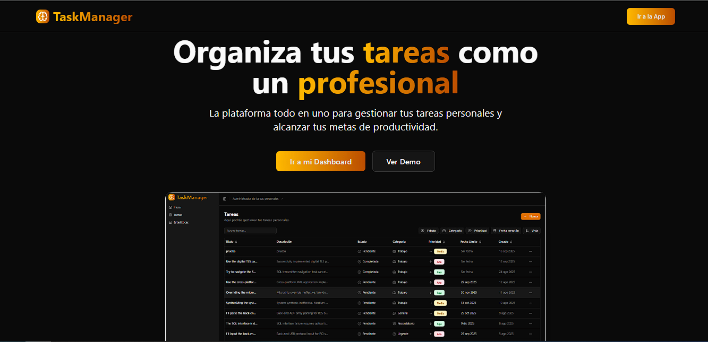
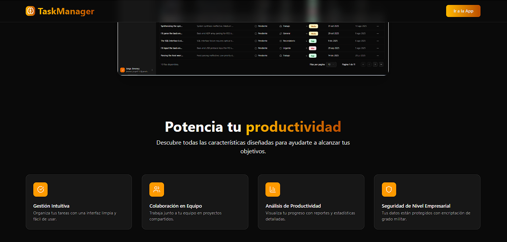
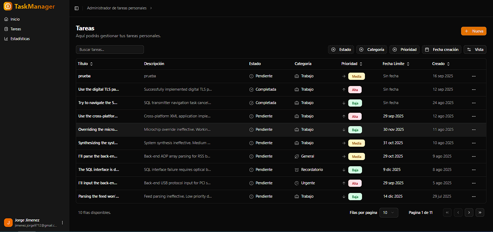
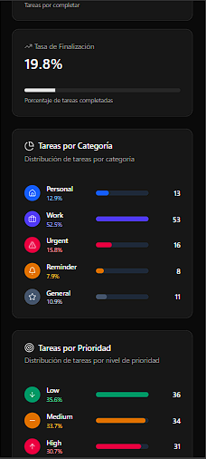

# Task Manager Frontend

Frontend de la aplicación **Task Manager**, desarrollado con **React + Vite**, conectado a un backend en **Node.js/Express/MongoDB** con autenticación mediante **Auth0**.

### Imagenes de la aplicacion:

<p align="center">
  
</p>

<p align="center">
  
</p>
<p align="center">
  
</p>
<p align="center">
  
</p>

---
---

## 🚀 Requisitos previos

Antes de empezar, asegúrate de tener instalado:

- [Node.js](https://nodejs.org/) (>= 18.x recomendado)
- [npm](https://docs.npmjs.com/) o [pnpm](https://pnpm.io/) (recomendado)

---

## ⚙️ Instalación

1. **Clona el repositorio:**
   ```bash
   git clone https://github.com/tuusuario/task-manager-frontend.git
   cd task-manager-frontend
   ```

2. **Instala las dependencias:**
   ```bash
   pnpm install
   ```
   > También puedes usar `npm install` o `yarn install`.

3. **Configura las variables de entorno:**
   Copia el archivo de ejemplo y ajusta los valores según tu entorno:
   ```bash
   cp .env.example .env
   ```

   Archivo `.env.example`:
   ```env
   VITE_HOST_API=http://localhost:3000/api
   VITE_AUTH0_DOMAIN=my-auth0-domain
   VITE_AUTH0_CLIENT_ID=my-auth0-client-id
   VITE_AUTH0_AUDIENCE=https://my-api.com
   ```

---

## 🛠️ Scripts disponibles

- **`pnpm dev`** → Levanta el proyecto en modo desarrollo (por defecto en `http://localhost:5173`).  
- **`pnpm build`** → Genera una build de producción en la carpeta `dist/`.  
- **`pnpm preview`** → Sirve la build de producción en local.  

---

## 🌐 Integración con el backend

El frontend consume la API alojada en:

```
VITE_HOST_API=http://localhost:3000/api
```

Para autenticación se utiliza **Auth0**, asegúrate de configurar correctamente las credenciales (`domain`, `client_id` y `audience`) en el dashboard de Auth0.

---

## 📂 Estructura del proyecto (simplificada)

```
.
├── src/              # Código fuente React (componentes, páginas, hooks, etc.)
├── public/           # Archivos estáticos
├── .env.example      # Variables de entorno de ejemplo
├── package.json
├── vite.config.ts
└── README.md
```

---

## 📌 Notas

- Asegúrate de tener el backend corriendo en `http://localhost:3000` para evitar problemas de CORS.  
- En producción deberás cambiar `VITE_HOST_API` a la URL de tu API desplegada.  
- Usa `pnpm build` y despliega la carpeta `dist/` en tu servicio de hosting preferido (Vercel, Netlify, etc.).  

---

## ✨ Autor

Creado por **[Jorge Jimenez]** 🛠️
```
